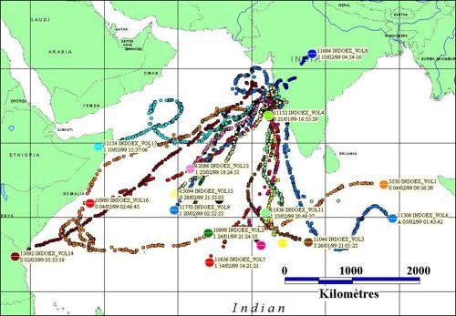

# BAMED

BAMED - Boundary Layer Pressurized Balloons trajectory simulation

BAMED is a Fortran based numeric tool that allows to simulate Boundary Layer Pressurized Balloons (BLPB) trajectories based on the given meteorological conditions. The model allows simulating balloon path from a given launch site (geographical coordinates) on the given date and time of the launch. The tool needs ECMWF meteorological data (wind, temperature, humidity, precipitation and surface pressure) as input data.

  |  

## Requirements
The BAMED tool is containerized into a Singularity container so one must have Singularity installed on the host system intended for simulations.

## Installation
```
git clone https://github.com/aeris-data/bamed.git
sudo singularity build ./bamed-image.sif ./bamed-container.def
```

The `singularity build` command will build the container `bamed-image.sif` from its definition file, using the source files got from the git repo; so for the build it is important to call the command from the git repo directory that one has made.

⚠️ ***The build requires either sudo rights or being able to use `--fakeroot` option (in a case of a multi-user server).*** 

Afterwards, the sif image can be placed anywhere (even on another system) independently of the source files. To run the image no sudo rights are required.

## Usage
The main script to launch is `bamed.py` which needs the input configuration file `user-config.xml` (which can be renamed, the name is not important). The Python script handles the launch combinations, writes input files for the Fortran executable and post-process simulation results. The main usage is 
```
python3 bamed.py --config user-config.xml [--shell-log]
```

⚠️ ***The script must be launched inside the Singularity container.*** 

The outputs of the simulation are : baloons estimated positions' coordinates in ASCII, netCDF and KML format + PNG map plot of the estimated trajectories. More details about input/output and folder structure are in the manual `SEDOO-AERIS-DT-003-MAG_BAMED_ATBD.pdf`.

There are two possible ways to launch the simulation inside the Singularity container:
- one-line command (run a command within a container, wait for the end of simulation to regain control of the shell)
```
$ singularity exec [--bind path1,path2] bamed-image.sif python3 bamed.py --config user-config.xml [--shell-log]
```
- interactive mode (run a shell within a container, then launch the command within the shell of the container)
```
$ singularity shell [--bind path1,path2] bamed-image.sif
Singularity> python3 bamed.py --config user-config.xml [--shell-log]
```

### Bind option

The `--bind` option allows to map directories on the host system to directories within the container. Most of the time, this option allows to solve the error *"File (or directory) not found"*, when all of the paths are configured correctly but the error persists. Here is why it can happen. When Singularity ‘swaps’ the host operating system for the one inside your container, the host file systems becomes partially inaccessible. The system administrator has the ability to define what bind paths will be included automatically inside each container. Some bind paths are automatically derived (e.g. a user’s home directory) and some are statically defined (e.g. bind paths in the Singularity configuration file). In the default configuration, the directories $HOME , /tmp , /proc , /sys , /dev, and $PWD are among the system-defined bind paths. Thus, in order to read and/or write files on the host system from within the container, one must to bind the necessary directories if they are not automatically included. Here’s an example of using the `--bind` option and binding `/data` on the host to `/mnt` in the container (`/mnt` does not need to already exist in the container):

```
$ ls /data
bar  foo

$ singularity exec --bind /data:/mnt my_container.sif ls /mnt
bar  foo
```

You can bind multiple directories in a single command with this syntax:

```
$ singularity shell --bind /opt,/data:/mnt my_container.sif
```

This will bind `/opt` on the host to `/opt` in the container and `/data` on the host to `/mnt` in the container.

## Input meteorological data extraction
The input data for the simulations is meteorological data : wind, temperature, humidity, precipitation and logarithm of surface pressure, coming from the ECMWF database. To extract and prepare the data in the correct format, the script `bamed-extract-ecmwf.sh` should be used. The script must be launched on the ECMWF MARS server (ecs, hpc or other). The data extraction was tested with a member-state user account. Other more public accounts might customize the script based on the MARS services or APIs available for their type of user.

The bash script can either extract the data and prepare it for the simulation, or it can extract the data, transfer it to the one's distant working server and automatically launch simulations on this server when the data extraction is finished. One must of course has the Singularity container and BAMED tool scripts on this working server. The input for this script is the configuration file ecmwf-user-parameters.conf, where the simulation and data parameters are indicated by the user. The main usage is `bamed-extract-ecmwf.sh --config ecmwf-user-parameters.conf`. In a case of a member-state user account, it is strongly advised to launch extractions as a SLURM batch job via `sbatch --wrap="bamed-extract-ecmwf.sh --config ecmwf-user-parameters.conf"` syntax.
